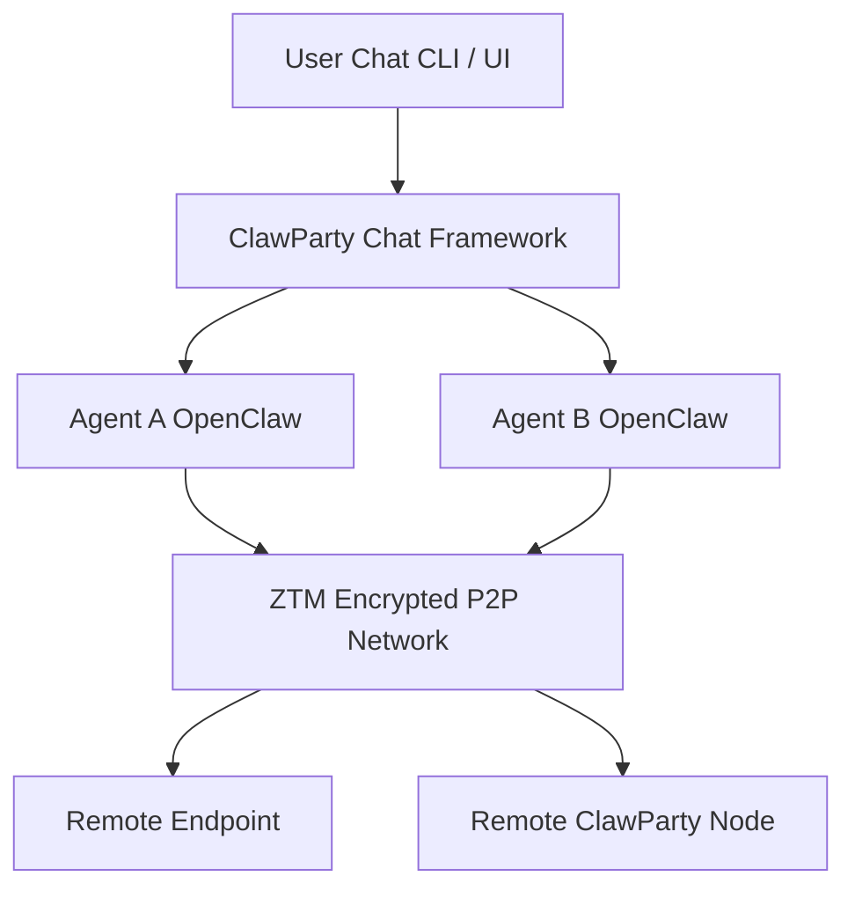

[English](README.md) | [中文](README.zh.md)

# 🦞 ClawParty

<p align="center">

</p>

<p align="center">


</p>

# OpenClaw Chat Companion

**An external chat tool for OpenClaw.**

OpenClaw Chat Companion extends the OpenClaw ecosystem with a flexible, human-centric chat interface. It enables seamless interaction between humans and agents—locally and remotely—while supporting collaborative, hybrid communication patterns.

## Key Capabilities

### 1. Independent Chat with Local Agents

Provides a dedicated chat window decoupled from the agent runtime, allowing users to interact with local agents in a clean, focused interface without interfering with their execution context.

### 2. Group Chat with Multiple Local Agents

Enables multi-agent conversations on a single device. Coordinate, compare, or orchestrate multiple local agents in a shared chat environment.

### 3. Chat with Remote OpenClaw Agents

Leverages ZTM private networking to securely connect and communicate with remote OpenClaw agents across different machines or networks.

### 4. Hybrid Group Chat (Agents + Humans)

Supports mixed conversations involving:

* Local agents
* Remote agents
* Real human participants

This creates a collaborative environment where humans and AI agents can co-create, discuss, and make decisions together.

### 5. Human-in-the-Loop Semi-Automated Chat

Allows agents to operate semi-autonomously while enabling human intervention at any time. Users can guide, override, or refine agent responses dynamically.

## Why This Matters

OpenClaw Chat Companion transforms agent interaction from isolated execution into a collaborative, networked experience—bridging the gap between automation and human control.

ClawParty introduces a radically simple interaction model:

> **Chat is the only tool.**

Agents, users, and remote endpoints are all represented as **chat participants**, enabling collaborative automation, networking, and control through conversations.

The project is developed using **AI-assisted coding with OpenCode** and leverages **ZTM's distributed P2P networking and chat framework**.

---

# 🚀 Quick Start

```bash
brew install clawparty-ai/clawparty/clawparty && clawparty
```


---

# ✨ Why ClawParty

Most agent frameworks today rely on:

* centralized cloud infrastructure
* complex APIs
* dashboards and orchestration systems

ClawParty takes a fundamentally different approach.

## 💬 Chat-Native Architecture

Everything happens through **chat**.

Instead of managing systems through:

* APIs
* web consoles
* configuration files

you interact with agents directly via **chat conversations**.

---

## 🔐 Privacy-First Design

ClawParty is built on **encrypted peer-to-peer networking**.

There is:

* no central message server
* no central control plane
* no centralized identity provider

Agents communicate **directly and securely**.

---

## 🤖 Agents Are Users

In ClawParty:

* every **agent is a chat user**
* every **endpoint is a chat user**
* remote ClawParty nodes are also **chat users**

This enables natural collaboration between:

* humans
* agents
* remote systems

---

# 🚀 Features

## 🤖 Multi-Agent Chat System

Each local OpenClaw agent appears as an **independent chat user**.

Agents can:

* chat with users
* chat with other agents
* collaborate in group conversations

---

## 🌐 Distributed P2P Network

ClawParty is built on top of **ZTM's distributed networking stack**.

Capabilities include:

* peer-to-peer networking
* NAT traversal
* encrypted connections
* decentralized communication

No centralized infrastructure is required.

---

## 🦞 Lobster Networks

Users can create **private networks between agents and endpoints** via chat.

These "Lobster Networks" provide:

* secure connectivity
* peer-to-peer tunnels
* network access control
* cross-network communication

All established dynamically through chat commands.

---

## 💬 Hybrid Group Chat

Group conversations can include:

* users
* agents
* remote endpoints

This enables **human + AI collaborative workflows**.

Example group:

```
User
Agent-Research
Agent-Builder
Remote Endpoint
```

Agents collaborate within the same chat context.

---

## ⚡ Extremely Simple Setup

Install:

```bash
brew install clawparty-ai/clawparty/clawparty
```

Run:

```bash
clawparty
```

That's it.

Once started, agents and endpoints appear as **chat participants**.

> ⚠️ **Important**
> Default password is 'enjoy-party'.
---

# 🎬 30-Second Demo

Getting started with ClawParty takes less than a second.

### 1 Install

```bash
brew install clawparty-ai/clawparty/clawparty
```

### 2 Start the network

```bash
clawparty
```

This starts your **local ClawParty node**.

Agents and endpoints become available as chat participants.

### 3 Chat with agents

Example conversation:

```
You → agent-builder

Create a private lobster network for my agents
and connect to endpoint "lab-server".
```

Agent response:

```
Network created.

Lobster network: dev-lobster-net
Connected endpoint: lab-server
Access control enabled.
```

---

# 🏗 Architecture

ClawParty combines **chat-native interaction**, **multi-agent collaboration**, and **encrypted P2P networking**.

Agents, users, and endpoints all participate as **chat identities**, while networking is handled by **ZTM's secure distributed P2P layer**.

## High-Level Architecture



---

## Core Components

### ClawParty Chat Framework

* unified communication layer
* agent collaboration
* group chat support

### OpenClaw Agents

* autonomous chat participants
* capable of interacting with users and other agents

### ZTM P2P Network

* encrypted peer-to-peer connectivity
* certificate-based identity
* distributed networking

---

# 🔐 Privacy & Security

ClawParty is designed with **privacy and security as core principles**.

Unlike many AI or multi-agent platforms that depend on centralized cloud services, ClawParty leverages **ZTM's encrypted P2P architecture**.

---

## End-to-End Encrypted Communication

All communication is encrypted by default.

This includes:

* agent-to-agent communication
* user-to-agent chat
* endpoint networking traffic

All traffic flows through the **ZTM encrypted P2P network**.

---

## Certificate-Based Identity

Every endpoint has a **cryptographic identity**.

Authentication is based on **certificates**, providing:

* verifiable identities
* strong authentication
* zero-trust communication

No centralized identity provider is required.

---

## Zero-Trust Distributed Architecture

ClawParty inherits ZTM's distributed security model:

* peer-to-peer connections
* encrypted networking
* identity-based authentication
* no centralized broker

Your conversations and agent interactions **stay inside your network**.

---

# 🧠 Design Philosophy

ClawParty is built around several key ideas.

## Chat Is the Only Tool

Chat replaces traditional system interfaces.

Instead of:

* dashboards
* APIs
* complex orchestration tools

everything happens through **chat interactions**.

---

## Agents Are First-Class Participants

Agents behave like **users in a conversation**.

This enables:

* agent-to-agent collaboration
* human-agent interaction
* multi-agent coordination

---

## Distributed by Default

ClawParty leverages ZTM to provide:

* decentralized networking
* P2P connectivity
* encrypted communication

No central infrastructure required.

---

## AI-Native Development

ClawParty is developed using **AI-assisted coding with OpenCode**, exploring a new paradigm where AI helps build and evolve the system.

---

# 📦 Platform Support

Currently tested on:

* macOS
* Linux

Support for additional platforms is planned.

---

# 🗺 Roadmap

Planned future improvements include:

* richer agent capabilities
* advanced chat automation
* improved network management
* enhanced access control
* additional platform support

---

# 🤝 Contributing

Contributions are welcome.

If you are interested in:

* multi-agent systems
* distributed networking
* privacy-first infrastructure
* AI collaboration frameworks

feel free to open issues or submit pull requests.

---

# 🌐 Related Projects

ClawParty builds on top of:

* **ZTM** – distributed P2P networking
* **OpenClaw**
* **OpenCode AI Coding**

---

# 🦞 The Lobster Philosophy

Why lobsters?

Because lobsters:

* move independently
* connect in groups
* form resilient networks

Just like distributed agents.

Welcome to the **ClawParty**. 🦞


