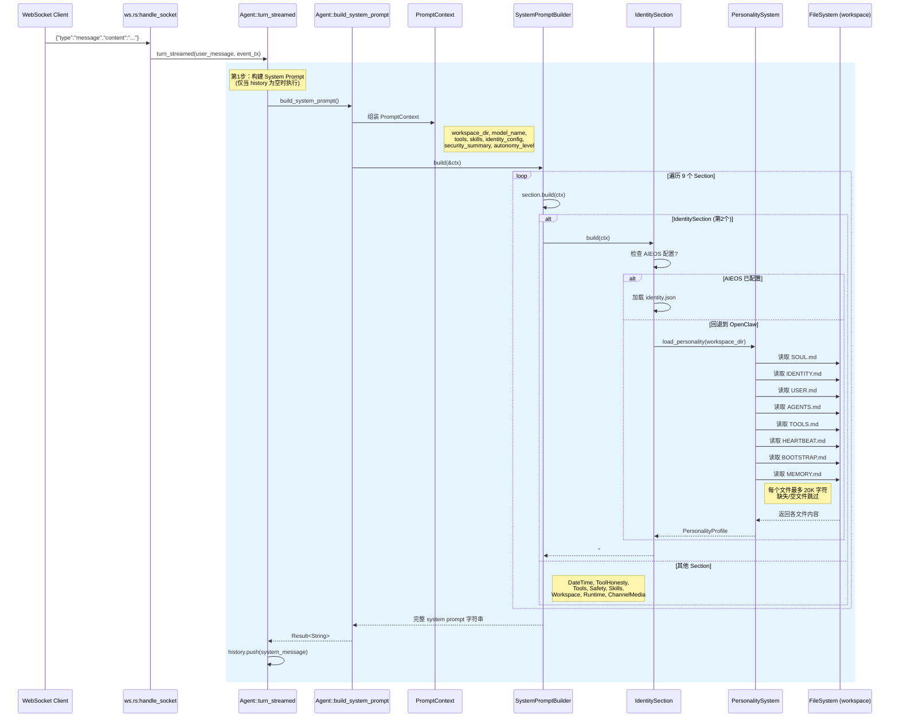
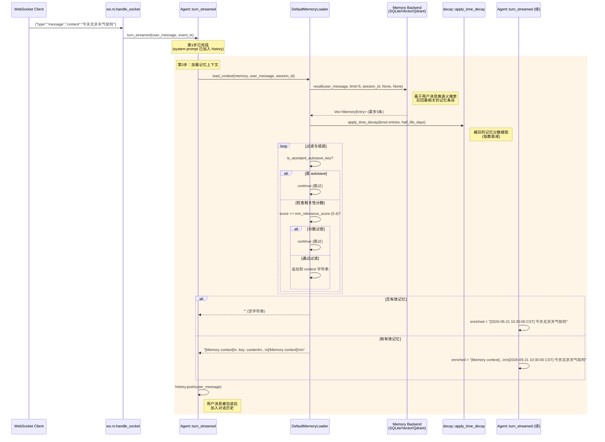

# ZeroClaw Prompt Flow 时序图

本文档描述 zeroclaw 在 `ws/chat` 收到用户消息后，构建 LLM 请求的两个核心步骤。

---

## 时序图一：build_system_prompt() — 系统提示构建

**关键代码路径**:
- `agent.rs:1004-1009` — 判断 history 为空，触发 build
- `agent.rs:629-644` — 组装 PromptContext，调用 builder
- `prompt.rs:46-59` — 9 个 Section 的定义
- `prompt.rs:91-123` — IdentitySection 加载 personality 文件
- `personality.rs:15-24` — 硬编码的 8 个 .md 文件列表
- `personality.rs:85-120` — 逐文件读取、截断、渲染

---

## 时序图二：memory_loader.load_context() — 记忆上下文加载

**关键代码路径**:
- `agent.rs:1012-1020` — 调用 memory_loader.load_context()
- `memory_loader.rs:40-79` — DefaultMemoryLoader 实现
- `memory_loader.rs:46-48` — 语义搜索 recall (limit=5)
- `memory_loader.rs:54` — 时间衰减
- `memory_loader.rs:56-69` — 过滤规则 (autosave/min_score)
- `agent.rs:1034-1039` — 时间戳前缀 + 合并到用户消息

---

## 两步对比

| | build_system_prompt() | memory_loader.load_context() |
|--|----------------------|------------------------------|
| **触发条件** | 仅首次（history 为空） | 每次消息都执行 |
| **数据源** | 文件系统（.md 文件） | 记忆后端（语义搜索） |
| **确定性** | 固定内容（除非文件修改） | 动态召回（与查询相关） |
| **输出位置** | System Message（role=system） | 用户消息前缀 |
| **可控性** | 目前无配置可过滤 | 通过 limit/min_score 可调 |
| **文件位置** | `personality.rs:15-24` | `memory_loader.rs:15-35` |
